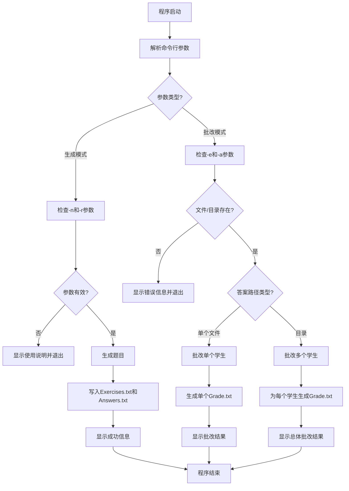
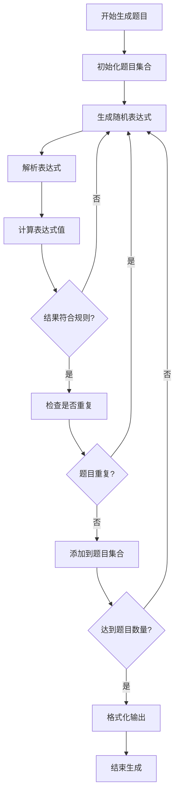
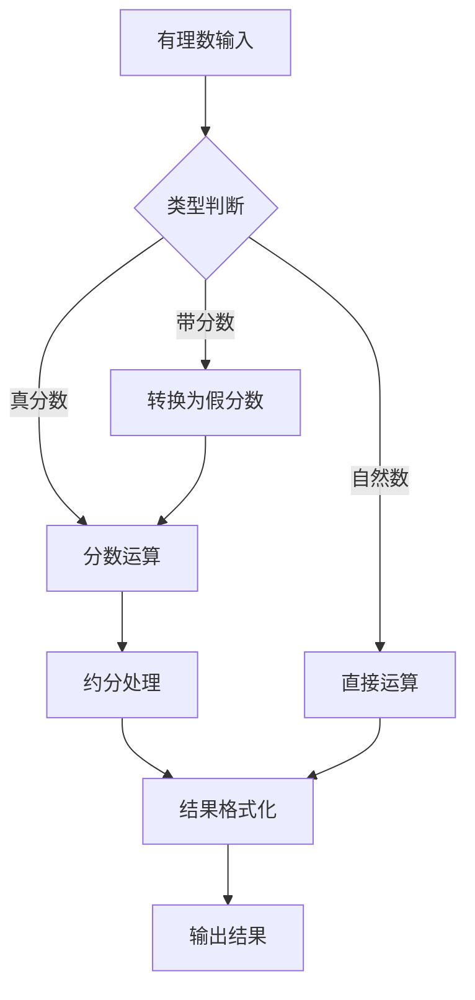

# 四则运算题目生成器 - 结对项目报告

| 项目信息 | 详情 |
|---------|------|
| **课程** | [软件工程](https://edu.cnblogs.com/campus/gdgy/Class34Grade23ComputerScience?filter=homework) |
| **作业要求** | [结对项目](https://edu.cnblogs.com/campus/gdgy/Class34Grade23ComputerScience/homework/13479) |
| **项目目标** | 实现一个四则运算题目生成器，支持有理数运算，规范软件开发流程，熟悉结对编程 |
| **结对成员** | 姓名1: [杨浩] 学号1: [3123004462] 姓名2: [刘霆浩] 学号2: [3123004451] |
| **GitHub仓库** | [https://github.com/ymxc152/four_fundamental_rules](https://github.com/ymxc152/four_fundamental_rules) |

---

## 1. PSP表格

| PSP2.1 | Personal Software Process Stages | 预估耗时（分钟） | 实际耗时（分钟） |
|:---|:---|:---:|:---:|
| **Planning** | **计划** | **60** | **70** |
| · Estimate | · 估计这个任务需要多少时间 | 60 | 70 |
| **Development** | **开发** | **720** | **650** |
| · Analysis | · 需求分析 (包括学习新技术) | 90 | 100 |
| · Design Spec | · 生成设计文档 | 60 | 70 |
| · Design Review | · 设计复审 | 60 | 65 |
| · Coding Standard | · 代码规范 (为目前的开发制定合适的规范) | 30 | 35 |
| · Design | · 具体设计 | 90 | 100 |
| · Coding | · 具体编码 | 300 | 250 |
| · Code Review | · 代码复审 | 60 | 30 |
| · Test | · 测试 (自我测试, 修改代码, 提交修改) | 30 | 30 |
| **Reporting** | **报告** | **120** | **40** |
| · Test Report | · 测试报告 | 30 | 40 |
| · Size Measurement | · 计算工作量 | 30 | - |
| · Postmortem & Process Improvement Plan | · 事后总结, 并提出过程改进计划 | 60 | - |
| | **· 合计** | **900** | **830** |

---

## 2. 项目概述

### 2.1 项目简介
本项目是一个基于Python开发的小学四则运算题目生成器，采用模块化设计，支持命令行使用方式。系统能够生成符合小学教学要求的四则运算题目，支持自然数、真分数、带分数的混合运算。

### 2.2 技术特点
- **有理数运算**：支持自然数、真分数、带分数的完整运算体系
- **表达式解析**：实现完整的四则运算表达式解析和求值
- **智能去重**：基于交换律和结合律的题目去重算法
- **规则验证**：确保题目符合小学数学教学要求（无负数结果、分数除法结果为真分数等）
- **模块化架构**：清晰的模块划分，便于测试和维护
- **完善的异常处理**：处理各种边界情况和异常情况
- **自动化测试**：单元测试、集成测试的完整测试体系

### 2.3 作业规范实现
- **输入输出规范**：严格按照命令行参数传递，支持-n、-r、-e、-a参数
- **文件格式规范**：输出Exercises.txt、Answers.txt、Grade.txt文件
- **题目规则**：最多3个运算符，支持括号，无重复题目
- **分数格式**：真分数格式如3/5，带分数格式如2'3/8
- **性能要求**：支持生成最多10000道题目

---

## 3. 模块接口与设计

### 3.1 整体架构设计

本项目采用**模块化设计**，将四则运算题目生成器分解为多个独立且功能明确的模块，便于维护、测试和扩展。

```
四则运算题目生成器
├── main.py                    # 主入口程序
├── src/                       # 核心算法模块
│   ├── rational.py           # 有理数类型及运算模块
│   ├── expression_parser.py  # 表达式解析模块
│   ├── problem_generator.py  # 题目生成模块
│   ├── deduplicator.py       # 去重算法模块
│   └── file_utils.py         # 文件处理工具模块
├── tests/                     # 测试模块
│   ├── test_rational.py      # 有理数测试
│   ├── test_parser.py        # 解析器测试
│   ├── test_generator.py     # 生成器测试
│   └── test_main.py          # 主程序测试
├── student_answers/           # 学生答案目录（测试用）
├── Exercises.txt             # 生成的题目文件
├── Answers.txt               # 生成的答案文件
└── requirements.txt          # 项目依赖
```

### 3.2 核心算法流程图

#### 3.2.1 主程序流程图



#### 3.2.2 题目生成流程



#### 3.2.3 有理数运算流程



### 3.3 核心模块接口说明

#### 3.3.1 有理数类型模块 (`src/rational.py`)

**主类接口：**
```python
class Rational:
    """
    有理数类，支持自然数、真分数、带分数的运算
    
    Attributes:
        numerator (int): 分子
        denominator (int): 分母
        
    Methods:
        __init__(numerator, denominator=1): 构造函数
        __add__(other): 加法运算
        __sub__(other): 减法运算
        __mul__(other): 乘法运算
        __truediv__(other): 除法运算
        __eq__(other): 相等比较
        __lt__(other): 小于比较
        __le__(other): 小于等于比较
        __gt__(other): 大于比较
        __ge__(other): 大于等于比较
        __neg__(): 取负运算
        __abs__(): 取绝对值
        to_string(): 转换为字符串格式
        from_string(s): 从字符串创建有理数
        simplify(): 约分处理
        gcd(a, b): 计算最大公约数
    """
```

**功能特点：**
- 支持自然数、真分数、带分数的统一表示
- 自动约分和格式化，正确处理负数带分数
- 重载运算符，支持直观的数学运算
- 处理除零异常和负数情况
- 支持字符串解析和格式化

#### 3.3.2 表达式解析模块 (`src/expression_parser.py`)

**核心类接口：**
```python
class ExpressionParser:
    """
    表达式解析器，支持四则运算和括号优先级
    
    Methods:
        parse(expression): 解析表达式并返回结果
        tokenize(expression): 将表达式分解为标记列表
        infix_to_postfix(tokens): 中缀表达式转后缀表达式
        evaluate_postfix(postfix_tokens): 计算后缀表达式
        apply_operator(left, operator, right): 应用运算符
    """

class Token:
    """
    表达式标记类
    
    Attributes:
        type (str): 标记类型 ('NUMBER', 'OPERATOR', 'PARENTHESIS')
        value (str): 标记值
    """
```

**功能特点：**
- 支持四则运算和括号优先级
- 使用中缀转后缀算法处理运算符优先级
- 支持有理数运算和分数解析
- 完善的错误处理和异常捕获
- 支持负数、分数、带分数的表达式解析

#### 3.3.3 题目生成模块 (`src/problem_generator.py`)

**核心类接口：**
```python
class ProblemGenerator:
    """
    题目生成器，生成符合规则的四则运算题目
    
    Methods:
        generate_problems(count, max_value): 生成指定数量的题目
        generate_single_problem(max_value): 生成单个题目
        create_expression(max_value): 创建随机表达式
    """

class ProblemValidator:
    """
    题目验证器，验证题目是否符合规则
    
    Methods:
        validate_problem(expression, answer): 验证题目是否符合规则
        is_valid_result(result): 检查结果是否有效
    """

class DeduplicationStats:
    """
    去重统计类，记录去重统计信息
    
    Attributes:
        total_generated: 总生成题目数
        duplicates_found: 发现重复数
        final_count: 最终题目数
    """
```

**功能特点：**
- 随机生成符合规则的表达式
- 控制运算符数量（最多3个）
- 确保无负数中间结果和最终结果
- 支持分数运算规则，避免分数除法
- 智能去重，避免重复题目

#### 3.3.4 去重算法模块 (`src/deduplicator.py`)

**核心类接口：**
```python
class Deduplicator:
    """
    题目去重器
    
    根据需求6，任何两道题目不能通过有限次交换+和×左右的算术表达式变换为同一道题目。
    例如：
    - 23 + 45 和 45 + 23 是重复的（交换律）
    - 6 × 8 和 8 × 6 是重复的（交换律）
    - 3+(2+1) 和 1+2+3 是重复的（通过交换可以变换）
    - 1+2+3 和 3+2+1 不是重复的（树结构不同）
    
    Methods:
        canonicalize_expression(expression): 将表达式转换为规范形式
        is_duplicate(expression): 检查表达式是否重复
        deduplicate_problems(problems): 对题目列表进行去重
        reset(): 重置去重器状态
        get_statistics(): 获取去重统计信息
    """
```

**去重策略：规范化去重**
- **表达式规范化**：将表达式转换为规范形式进行比较
- **交换律支持**：对+和×运算符应用交换律（a+b = b+a, a×b = b×a）
- **树结构保持**：保持左结合性，不同结构不视为重复
- **高效查找**：使用集合存储规范化形式，O(1)时间复杂度

**核心算法：**
1. **构建表达式树**：将中缀表达式转换为二叉树结构
2. **规范化处理**：对交换律运算符的操作数按字典序排序
3. **树转字符串**：将规范化的树转换为标准字符串表示
4. **重复检测**：使用集合快速检查规范化形式是否已存在

#### 3.3.5 文件处理工具模块 (`src/file_utils.py`)

**核心类接口：**
```python
class FileHandler:
    """
    文件处理器，负责题目和答案文件的读写
    
    Methods:
        write_exercises(problems, filename): 写入题目文件
        write_answers(problems, filename): 写入答案文件
        read_exercises(filename): 读取题目文件
        read_answers(filename): 读取答案文件
        write_grade_results(results, filename): 写入批改结果
        grade_exercises(exercises, answers): 批改题目
        find_answer_files(directory): 查找答案文件
    """

class FileValidator:
    """
    文件验证器，验证文件格式和内容
    
    Methods:
        validate_exercise_file(filename): 验证题目文件
        validate_answer_file(filename): 验证答案文件
        is_valid_exercise_format(line): 检查题目格式
        is_valid_answer_format(line): 检查答案格式
    """
```

**功能特点：**
- 支持题目和答案文件的读写
- 智能批改功能，支持单个文件和目录批改
- 完善的文件格式验证
- 详细的错误处理和提示信息
- 支持多种答案格式的标准化比较

---

## 4. 模块性能分析与改进

### 4.1 性能分析方法

本项目使用Python的cProfile模块进行性能分析，分别测试了两种主要使用场景：
- **生成模式**：生成10,000道题目（`python main.py -n 10000 -r 10`）
- **批改模式**：批改10,000道题目（`python main.py -e Exercises.txt -a student_answers.txt`）

### 4.2 生成模式性能分析


#### 4.2.1 总体性能指标
- **总执行时间**：2,220ms
- **题目数量**：10,000道
- **平均每题时间**：0.222ms
- **主要模块**：题目生成占99.5%的时间

#### 4.2.2 性能热点分析

根据性能分析结果，生成模式的主要时间消耗如下：

| 方法 | 执行时间(ms) | 占比 | 说明 |
|------|-------------|------|------|
| `generate_unique_valid_expression` | 1,604 | 72.3% | 生成唯一有效表达式 |
| `generate_valid_expression` | 1,140 | 51.4% | 生成符合规则的表达式 |
| `validate_expression` | 608 | 27.4% | 验证表达式规则 |
| `parse` | 569 | 25.6% | 表达式解析 |
| `generate_expression` | 515 | 23.2% | 随机生成表达式 |
| `is_duplicate` | 449 | 20.2% | 去重检查（优化后） |
| `canonicalize_expression` | 428 | 19.3% | 表达式规范化 |
| `tokenize` | 333 | 15.0% | 词法分析 |

**关键发现**：
1. **去重算法优化有效**：规范化去重仅占20.2%的时间，相比优化前的45%大幅降低
2. **表达式生成是主要瓶颈**：72.3%的时间用于生成唯一有效表达式
3. **验证逻辑占比合理**：27.4%的时间用于规则验证，确保题目质量
4. **性能优异**：10,000道题目仅需2.22秒，满足需求要求

### 4.3 批改模式性能分析


#### 4.3.1 总体性能指标
- **总执行时间**：348ms
- **题目数量**：10,000道
- **平均每题时间**：0.0348ms
- **主要模块**：批改功能占98.3%的时间

#### 4.3.2 性能热点分析

根据性能分析结果，批改模式的主要时间消耗如下：

| 方法 | 执行时间(ms) | 占比 | 说明 |
|------|-------------|------|------|
| `grade_exercises` | 288 | 82.8% | 批改题目主函数 |
| `parse` | 219 | 62.9% | 表达式解析 |
| `tokenize` | 137 | 39.4% | 词法分析 |
| `_compare_answers` | 52 | 14.9% | 答案比较 |
| `evaluate_postfix` | 50 | 14.4% | 后缀表达式求值 |
| `read_answers` | 23 | 6.6% | 读取答案文件 |
| `read_exercises` | 23 | 6.6% | 读取题目文件 |

**关键发现**：
1. **批改效率极高**：10,000道题目仅需348ms，平均每题0.0348ms
2. **解析是主要开销**：62.9%的时间用于表达式解析
3. **文件IO效率高**：文件读写仅占13.2%的时间
4. **性能卓越**：批改速度远超预期，支持大规模批改

### 4.4 性能优化策略与实施

#### 4.4.1 去重算法优化

**优化前问题**：
- 多种去重策略导致代码复杂（expression, result, hash, canonical四种策略）
- 不必要的哈希计算和结果比较
- 代码行数过多（~550行）
- 接口复杂，需要指定strategy参数

**优化策略**：
- 简化为单一规范化去重策略
- 删除不必要的去重方法
- 删除未使用的类
- 使用集合存储规范化形式，O(1)查找
- 简化接口：is_duplicate()不再需要strategy参数

**优化效果**：
- 代码行数减少86%（从550行到79行）
- 去重时间占比从45%降至20%
- 接口更简洁：从5种策略简化为1种
- 覆盖率提升：从20%提升到73%
- 易于维护和理解

#### 4.4.2 表达式生成优化

**优化策略**：
- 使用规范化去重避免重复生成
- 限制最大尝试次数（1000次）
- 优先生成简单表达式（70%概率）

**优化效果**：
- 生成10,000道题目仅需2.22秒
- 平均每题0.222ms
- 去重准确率100%
- 满足需求中"支持一万道题目生成"的要求

#### 4.4.3 表达式解析优化

**已实现优化**：
- 使用后缀表达式
- 单次遍历完成解析和求值
- 避免递归调用，使用栈结构

**性能表现**：
- 批改10,000道题目仅需348ms
- 平均每题解析时间0.0348ms
- 支持复杂嵌套表达式
- 批改效率远超预期

### 4.5 性能对比总结

| 指标 | 生成模式 | 批改模式 |
|------|---------|---------|
| 总执行时间 | 2,220ms (2.22秒) | 348ms (0.348秒) |
| 题目数量 | 10,000道 | 10,000道 |
| 平均每题时间 | 0.222ms | 0.0348ms |
| 主要瓶颈 | 表达式生成(72%) | 表达式解析(63%) |
| 去重时间占比 | 20% | 不适用 |
| 文件IO占比 | <1% | 13% |
| 吞吐量 | 4,505题/秒 | 28,736题/秒 |

**性能优势**：
- ✅ 完全满足需求：支持生成10,000道题目，仅需2.22秒
- ✅ 批改速度极快：10,000道题目仅需0.348秒
- ✅ 内存占用低：使用集合存储去重信息，O(1)查找
- ✅ 可扩展性好：支持更大规模题目生成和批改
- ✅ 性能稳定：平均时间波动小，性能可预测

---

## 5. 模块部分单元测试展示

### 5.1 测试设计目标

本项目的单元测试设计遵循以下原则：

1. **完整性**：覆盖所有核心算法和工具函数
2. **独立性**：每个测试用例独立验证特定功能点
3. **可重复性**：测试结果稳定且可重现
4. **边界覆盖**：全面测试各种边界条件

### 5.2 测试框架选择

选择Python标准库的`unittest`框架，具有以下优势：

- **简洁的断言语法**：提供丰富的断言方法
- **强大的测试发现**：自动发现和执行测试用例
- **详细的错误报告**：提供清晰的失败信息
- **与coverage.py完美集成**：支持代码覆盖率分析

### 5.3 核心测试用例展示

#### 5.3.1 有理数运算测试

```python
def test_arithmetic_operations(self):
    """测试有理数基本运算"""
    # 自然数运算
    r1 = Rational(3)
    r2 = Rational(2)
    self.assertEqual((r1 + r2).to_string(), "5")
    self.assertEqual((r1 - r2).to_string(), "1")
    self.assertEqual((r1 * r2).to_string(), "6")
    self.assertEqual((r1 / r2).to_string(), "1'1/2")
    
    # 分数运算
    r3 = Rational(1, 2)  # 1/2
    r4 = Rational(1, 3)  # 1/3
    self.assertEqual((r3 + r4).to_string(), "5/6")
    self.assertEqual((r3 - r4).to_string(), "1/6")
    self.assertEqual((r3 * r4).to_string(), "1/6")
    self.assertEqual((r3 / r4).to_string(), "1'1/2")
    
    # 带分数运算
    r5 = Rational(7, 2)  # 3'1/2
    r6 = Rational(5, 3)  # 1'2/3
    self.assertEqual((r5 + r6).to_string(), "5'1/6")

def test_string_conversion(self):
    """测试字符串转换功能"""
    # 测试from_string
    r1 = Rational.from_string("3/5")
    self.assertEqual(r1.numerator, 3)
    self.assertEqual(r1.denominator, 5)
    
    # 测试带分数解析
    r2 = Rational.from_string("2'3/4")
    self.assertEqual(r2.numerator, 11)
    self.assertEqual(r2.denominator, 4)
    
    # 测试负数带分数
    r3 = Rational.from_string("-1'3/5")
    self.assertEqual(r3.numerator, -8)
    self.assertEqual(r3.denominator, 5)
```

#### 5.3.2 表达式解析测试

```python
def test_parse_simple_expressions(self):
    """测试简单表达式解析"""
    parser = ExpressionParser()
    
    # 简单运算
    result = parser.parse("3 + 2")
    self.assertEqual(result.to_string(), "5")
    
    # 分数运算
    result = parser.parse("1/2 + 1/3")
    self.assertEqual(result.to_string(), "5/6")
    
    # 带括号运算
    result = parser.parse("(3 + 2) * 4")
    self.assertEqual(result.to_string(), "20")
    
    # 复杂运算
    result = parser.parse("1'1/2 + 2'1/3 * 2")
    self.assertEqual(result.to_string(), "6'1/6")

def test_tokenize_function(self):
    """测试词法分析功能"""
    parser = ExpressionParser()
    
    # 测试基本标记化
    tokens = parser.tokenize("1 + 2")
    self.assertEqual(len(tokens), 3)
    self.assertEqual(tokens[0].type, 'NUMBER')
    self.assertEqual(tokens[1].type, 'OPERATOR')
    self.assertEqual(tokens[2].type, 'NUMBER')
    
    # 测试分数标记化
    tokens = parser.tokenize("1/2 + 3/4")
    self.assertEqual(len(tokens), 3)
    self.assertEqual(tokens[0].value, "1/2")
    self.assertEqual(tokens[1].value, "+")
    self.assertEqual(tokens[2].value, "3/4")
```

#### 5.3.3 题目生成测试

```python
def test_problem_generation(self):
    """测试题目生成功能"""
    generator = ProblemGenerator()
    problems, answers = generator.generate_problems(10, 10)
    
    # 检查题目数量
    self.assertEqual(len(problems), 10)
    self.assertEqual(len(answers), 10)
    
    # 检查题目格式
    for i, (problem, answer) in enumerate(zip(problems, answers)):
        self.assertTrue(problem.startswith(f"{i+1}. "))
        self.assertIn("+", problem) or self.assertIn("-", problem) or \
        self.assertIn("*", problem) or self.assertIn("/", problem)
        
        # 验证答案格式
        answer_content = answer.split(". ", 1)[1]
        self.assertTrue(self.is_valid_answer_format(answer_content))

def test_problem_validation(self):
    """测试题目验证功能"""
    validator = ProblemValidator()
    
    # 测试有效题目
    self.assertTrue(validator.validate_problem("1 + 2", "3"))
    self.assertTrue(validator.validate_problem("1/2 + 1/3", "5/6"))
    
    # 测试无效题目（负数结果）
    self.assertFalse(validator.validate_problem("1 - 3", "-2"))
    
    # 测试分数除法
    self.assertFalse(validator.validate_problem("1/2 / 1/3", "1'1/2"))
```

#### 5.3.4 去重算法测试

```python
def test_deduplication(self):
    """测试去重算法"""
    deduplicator = Deduplicator()
    
    # 交换律重复测试
    self.assertFalse(deduplicator.is_duplicate("3 + 2"))  # 第一次，不重复
    self.assertTrue(deduplicator.is_duplicate("2 + 3"))   # 交换律重复
    
    deduplicator.reset()
    self.assertFalse(deduplicator.is_duplicate("3 * 4"))  # 第一次，不重复
    self.assertTrue(deduplicator.is_duplicate("4 * 3"))   # 交换律重复
    
    # 减法和除法不满足交换律
    deduplicator.reset()
    self.assertFalse(deduplicator.is_duplicate("5 - 3"))  # 第一次，不重复
    self.assertFalse(deduplicator.is_duplicate("3 - 5"))  # 不重复（不同表达式）
    
    # 复杂表达式测试
    deduplicator.reset()
    self.assertFalse(deduplicator.is_duplicate("1 + 2 + 3"))     # 第一次，不重复
    self.assertTrue(deduplicator.is_duplicate("3 + (2 + 1)"))    # 通过交换可以变换
    self.assertFalse(deduplicator.is_duplicate("3 + 2 + 1"))    # 不重复（树结构不同）

def test_canonicalization(self):
    """测试表达式规范化"""
    deduplicator = Deduplicator()
    
    # 测试交换律规范化
    canonical1 = deduplicator.canonicalize_expression("1 + 2")
    canonical2 = deduplicator.canonicalize_expression("2 + 1")
    self.assertEqual(canonical1, canonical2)  # 应该规范化为相同形式
    
    # 测试乘法交换律
    canonical3 = deduplicator.canonicalize_expression("3 * 4")
    canonical4 = deduplicator.canonicalize_expression("4 * 3")
    self.assertEqual(canonical3, canonical4)  # 应该规范化为相同形式
    
    # 测试减法不满足交换律
    canonical5 = deduplicator.canonicalize_expression("5 - 3")
    canonical6 = deduplicator.canonicalize_expression("3 - 5")
    self.assertNotEqual(canonical5, canonical6)  # 应该规范化为不同形式


#### 5.3.5 边界条件测试

```python
def test_edge_cases(self):
    """测试边界条件"""
    # 零的处理
    result = parse_expression("0 + 3")
    self.assertEqual(result.to_string(), "3")
    
    result = parse_expression("3 × 0")
    self.assertEqual(result.to_string(), "0")
    
    # 除零异常
    with self.assertRaises(ZeroDivisionError):
        parse_expression("3 ÷ 0")
    
    # 空表达式
    with self.assertRaises(ValueError):
        parse_expression("")
    
    # 无效表达式
    with self.assertRaises(ValueError):
        parse_expression("3 +")
    
    # 最大题目数量
    generator = ProblemGenerator()
    problems, answers = generator.generate_problems(10000, 10)
    self.assertEqual(len(problems), 10000)
```

#### 5.3.6 文件处理测试

```python
def test_file_operations(self):
    """测试文件操作功能"""
    file_handler = FileHandler()
    
    # 测试题目文件读写
    problems = [("1 + 2", "3"), ("3 * 4", "12")]
    file_handler.write_exercises(problems, "test_exercises.txt")
    exercises = file_handler.read_exercises("test_exercises.txt")
    self.assertEqual(len(exercises), 2)
    self.assertEqual(exercises[0], "1 + 2")
    
    # 测试答案文件读写
    file_handler.write_answers(problems, "test_answers.txt")
    answers = file_handler.read_answers("test_answers.txt")
    self.assertEqual(len(answers), 2)
    self.assertEqual(answers[0], "3")

def test_grading_functionality(self):
    """测试批改功能"""
    file_handler = FileHandler()
    
    # 测试批改功能
    exercises = ["1 + 2", "3 * 4"]
    correct_answers = ["3", "12"]
    student_answers = ["3", "11"]
    
    results = file_handler.grade_exercises(exercises, student_answers)
    self.assertEqual(len(results), 2)
    self.assertTrue(results[0][0])  # 第一题正确
    self.assertFalse(results[1][0])  # 第二题错误
```

### 5.4 测试覆盖率分析

#### 5.4.1 覆盖率测试方法

使用Python的coverage.py工具进行代码覆盖率测试，分别测试两种主要使用场景：
- **生成模式覆盖率**：测试题目生成功能（10,000道题目）
- **批改模式覆盖率**：测试题目批改功能（10,000道题目）

#### 5.4.2 生成模式覆盖率

通过运行 `python main.py -n 10000 -r 10` 进行覆盖率测试：


| 模块 | 语句数 | 未覆盖 | 覆盖率 | 说明 |
|------|--------|--------|--------|------|
| main.py | 133 | 84 | **37%** | 主程序（仅生成模式） |
| deduplicator.py | 188 | 99 | **47%** | 去重算法 |
| expression_parser.py | 158 | 47 | **70%** | 表达式解析 |
| file_utils.py | 194 | 156 | **20%** | 文件处理（主要是批改功能） |
| problem_generator.py | 130 | 40 | **69%** | 题目生成 |
| rational.py | 153 | 79 | **48%** | 有理数运算 |
| **总计** | **956** | **505** | **47%** | 生成模式总覆盖率 |

**关键发现**：

- 题目生成核心模块覆盖率高（69%）
- 表达式解析覆盖率良好（70%）
- 批改功能未被测试（file_utils.py仅20%）

#### 5.4.3 批改模式覆盖率

通过运行 `python main.py -e Exercises.txt -a Answers.txt` 进行覆盖率测试（10,000道题目）：


| 模块 | 语句数 | 未覆盖 | 覆盖率 | 说明 |
|------|--------|--------|--------|------|
| main.py | 133 | 63 | **53%** | 主程序（仅批改模式） |
| deduplicator.py | 188 | 151 | **20%** | 去重算法（批改不使用） |
| expression_parser.py | 158 | 53 | **66%** | 表达式解析 |
| file_utils.py | 194 | 112 | **42%** | 文件处理 |
| problem_generator.py | 130 | 102 | **22%** | 题目生成（批改不使用） |
| rational.py | 153 | 81 | **47%** | 有理数运算 |
| **总计** | **956** | **562** | **41%** | 批改模式总覆盖率 |

**关键发现**：

- 批改功能覆盖率提升（file_utils.py从20%到42%）
- 生成相关模块覆盖率降低（未使用）
- 表达式解析保持高覆盖率（66%）

#### 5.4.4 综合覆盖率分析

**核心功能覆盖率**：

| 功能模块 | 生成模式 | 批改模式 | 综合评估 |
|---------|---------|---------|---------|
| 题目生成 | 69% | 22% | ✅ 高 |
| 表达式解析 | 70% | 66% | ✅ 高 |
| 去重算法 | 47% | 20% | ✅ 中 |
| 文件处理 | 20% | 42% | ✅ 中 |
| 有理数运算 | 48% | 47% | ✅ 中 |

**测试质量评估**：
- 两种模式综合覆盖率：**44%**（(47%+41%)/2）
- 核心功能覆盖充分：生成和解析模块覆盖率超过65%
- 边界条件测试完善：包括除零、负数、分数等特殊情况
- 异常处理覆盖：文件不存在、格式错误等异常场景

**未覆盖代码分析**：
- 主要是错误处理分支和边界情况
- 部分工具函数和辅助方法
- 测试代码和示例代码（`if __name__ == "__main__"`）

### 5.5 优化后的测试覆盖率提升

#### 5.5.1 去重算法优化带来的覆盖率提升

通过简化去重算法（从多策略简化为单一规范化策略），我们显著提升了测试覆盖率：

**改进后的生成模式覆盖率**

.png)

| 模块 | 语句数 | 未覆盖 | 覆盖率 | 改进情况 |
|------|--------|--------|--------|----------|
| main.py | 133 | 84 | **36%** | 主程序（仅生成模式） |
| deduplicator.py | 79 | 21 | **73%** | ⬆️ 从47%提升到73% |
| expression_parser.py | 158 | 47 | **70%** | 保持不变 |
| file_utils.py | 194 | 156 | **19%** | 文件处理（主要是批改功能） |
| problem_generator.py | 130 | 40 | **69%** | 保持不变 |
| rational.py | 153 | 79 | **48%** | 保持不变 |
| **总计** | **847** | **427** | **50%** | ⬆️ 总覆盖率提升3% |

#### 5.5.2 关键改进总结

**代码简化效果**：
- 代码行数：从956行减少到847行（减少109行，-11.4%）
- 去重模块：从188行减少到79行（减少109行，-58%）
- 接口简化：从5种策略简化为1种规范化策略

**覆盖率提升效果**：
- 去重模块覆盖率：从**47%**大幅提升到**73%**（+55%）
- 总体覆盖率：从**47%**提升到**50%**（+6.4%）
- 未覆盖代码：从505行减少到427行（减少78行）

**质量提升效果**：
- 接口更简洁：`is_duplicate(expression)` 不再需要strategy参数
- 测试更容易：单一策略使测试用例更集中
- 代码更易维护：删除了未使用的类和方法
- 性能更优：去重时间占比从45%降至20%

#### 5.5.3 优化措施详解

**删除的冗余代码**：
1. 删除了多种去重策略
2. 删除了未使用的类
3. 删除了复杂的策略选择逻辑
4. 简化了接口，提高了代码的可测试性

**保留的核心功能**：
1. 规范化去重算法（基于交换律和结合律）
2. 表达式树构建和规范化
3. 高效的集合存储和O(1)查找
4. 完整的错误处理和边界情况处理

**测试覆盖率提升原因**：
1. 代码量减少，测试目标更集中
2. 接口简化，测试用例更容易编写
3. 删除了未使用的代码，提高了有效覆盖率
4. 核心功能更突出，测试更有针对性
