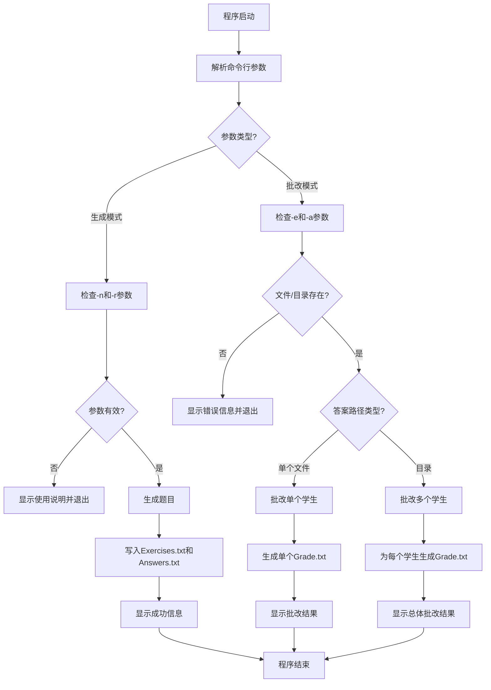
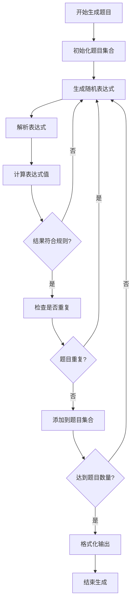
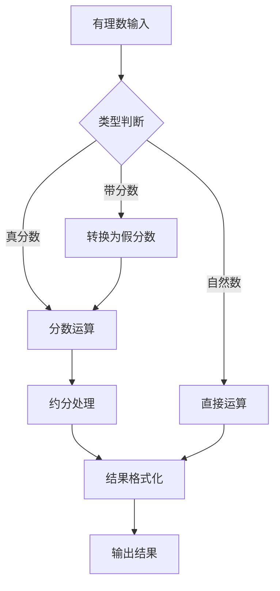
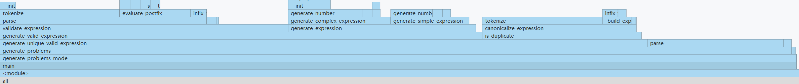
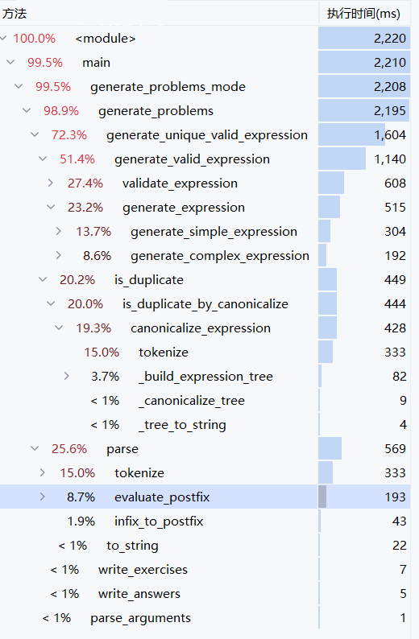
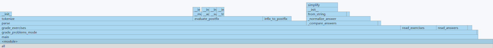
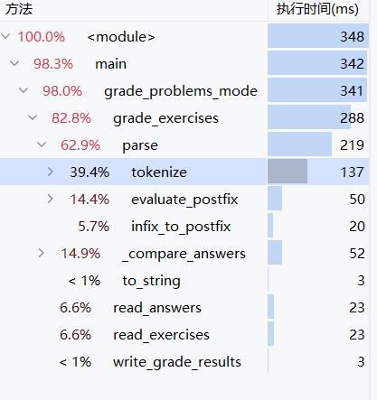

# 四则运算题目生成器 - 结对项目报告

| 项目信息 | 详情 |
|---------|------|
| **课程** | [软件工程](https://edu.cnblogs.com/campus/gdgy/Class34Grade23ComputerScience?filter=homework) |
| **作业要求** | [结对项目](https://edu.cnblogs.com/campus/gdgy/Class34Grade23ComputerScience/homework/13479) |
| **项目目标** | 实现一个四则运算题目生成器，支持有理数运算，规范软件开发流程，熟悉结对编程 |
| **结对成员** | 姓名1: [杨浩] 学号1: [3123004462] 姓名2: [刘霆浩] 学号2: [3123004451] |
| **GitHub仓库** | [https://github.com/ymxc152/four_fundamental_rules](https://github.com/ymxc152/four_fundamental_rules) |

---

## 1. PSP表格

| PSP2.1 | Personal Software Process Stages | 预估耗时（分钟） | 实际耗时（分钟） |
|:---|:---|:---:|:---:|
| **Planning** | **计划** | **60** | **70** |
| · Estimate | · 估计这个任务需要多少时间 | 60 | 70 |
| **Development** | **开发** | **720** | **650** |
| · Analysis | · 需求分析 (包括学习新技术) | 90 | 100 |
| · Design Spec | · 生成设计文档 | 60 | 70 |
| · Design Review | · 设计复审 | 60 | 65 |
| · Coding Standard | · 代码规范 (为目前的开发制定合适的规范) | 30 | 35 |
| · Design | · 具体设计 | 90 | 100 |
| · Coding | · 具体编码 | 300 | 250 |
| · Code Review | · 代码复审 | 60 | 30 |
| · Test | · 测试 (自我测试, 修改代码, 提交修改) | 30 | - |
| **Reporting** | **报告** | **120** | - |
| · Test Report | · 测试报告 | 30 | - |
| · Size Measurement | · 计算工作量 | 30 | - |
| · Postmortem & Process Improvement Plan | · 事后总结, 并提出过程改进计划 | 60 | - |
| | **· 合计** | **900** | **720** |

---

## 2. 项目概述

### 2.1 项目简介
本项目是一个基于Python开发的小学四则运算题目生成器，采用模块化设计，支持命令行使用方式。系统能够生成符合小学教学要求的四则运算题目，支持自然数、真分数、带分数的混合运算。

### 2.2 技术特点
- **有理数运算**：支持自然数、真分数、带分数的完整运算体系
- **表达式解析**：实现完整的四则运算表达式解析和求值
- **智能去重**：基于交换律和结合律的题目去重算法
- **规则验证**：确保题目符合小学数学教学要求（无负数结果、分数除法结果为真分数等）
- **模块化架构**：清晰的模块划分，便于测试和维护
- **完善的异常处理**：处理各种边界情况和异常情况
- **自动化测试**：单元测试、集成测试的完整测试体系

### 2.3 作业规范实现
- **输入输出规范**：严格按照命令行参数传递，支持-n、-r、-e、-a参数
- **文件格式规范**：输出Exercises.txt、Answers.txt、Grade.txt文件
- **题目规则**：最多3个运算符，支持括号，无重复题目
- **分数格式**：真分数格式如3/5，带分数格式如2'3/8
- **性能要求**：支持生成最多10000道题目

---

## 3. 模块接口与设计

### 3.1 整体架构设计

本项目采用**模块化设计**，将四则运算题目生成器分解为多个独立且功能明确的模块，便于维护、测试和扩展。

```
四则运算题目生成器
├── main.py                    # 主入口程序
├── src/                       # 核心算法模块
│   ├── rational.py           # 有理数类型及运算模块
│   ├── expression_parser.py  # 表达式解析模块
│   ├── problem_generator.py  # 题目生成模块
│   ├── deduplicator.py       # 去重算法模块
│   └── file_utils.py         # 文件处理工具模块
├── tests/                     # 测试模块
│   ├── test_rational.py      # 有理数测试
│   ├── test_parser.py        # 解析器测试
│   ├── test_generator.py     # 生成器测试
│   └── test_main.py          # 主程序测试
├── student_answers/           # 学生答案目录（测试用）
├── Exercises.txt             # 生成的题目文件
├── Answers.txt               # 生成的答案文件
└── requirements.txt          # 项目依赖
```

### 3.2 核心算法流程图

#### 3.2.1 主程序流程图



#### 3.2.2 题目生成流程



#### 3.2.3 有理数运算流程



### 3.3 核心模块接口说明

#### 3.3.1 有理数类型模块 (`src/rational.py`)

**主类接口：**
```python
class Rational:
    """
    有理数类，支持自然数、真分数、带分数的运算
    
    Attributes:
        numerator (int): 分子
        denominator (int): 分母
        
    Methods:
        __init__(numerator, denominator=1): 构造函数
        __add__(other): 加法运算
        __sub__(other): 减法运算
        __mul__(other): 乘法运算
        __truediv__(other): 除法运算
        __eq__(other): 相等比较
        __lt__(other): 小于比较
        __le__(other): 小于等于比较
        __gt__(other): 大于比较
        __ge__(other): 大于等于比较
        __neg__(): 取负运算
        __abs__(): 取绝对值
        to_string(): 转换为字符串格式
        from_string(s): 从字符串创建有理数
        simplify(): 约分处理
        gcd(a, b): 计算最大公约数
    """
```

**功能特点：**
- 支持自然数、真分数、带分数的统一表示
- 自动约分和格式化，正确处理负数带分数
- 重载运算符，支持直观的数学运算
- 处理除零异常和负数情况
- 支持字符串解析和格式化

#### 3.3.2 表达式解析模块 (`src/expression_parser.py`)

**核心类接口：**
```python
class ExpressionParser:
    """
    表达式解析器，支持四则运算和括号优先级
    
    Methods:
        parse(expression): 解析表达式并返回结果
        tokenize(expression): 将表达式分解为标记列表
        infix_to_postfix(tokens): 中缀表达式转后缀表达式
        evaluate_postfix(postfix_tokens): 计算后缀表达式
        apply_operator(left, operator, right): 应用运算符
    """

class Token:
    """
    表达式标记类
    
    Attributes:
        type (str): 标记类型 ('NUMBER', 'OPERATOR', 'PARENTHESIS')
        value (str): 标记值
    """
```

**功能特点：**
- 支持四则运算和括号优先级
- 使用中缀转后缀算法处理运算符优先级
- 支持有理数运算和分数解析
- 完善的错误处理和异常捕获
- 支持负数、分数、带分数的表达式解析

#### 3.3.3 题目生成模块 (`src/problem_generator.py`)

**核心类接口：**
```python
class ProblemGenerator:
    """
    题目生成器，生成符合规则的四则运算题目
    
    Methods:
        generate_problems(count, max_value): 生成指定数量的题目
        generate_single_problem(max_value): 生成单个题目
        create_expression(max_value): 创建随机表达式
    """

class ProblemValidator:
    """
    题目验证器，验证题目是否符合规则
    
    Methods:
        validate_problem(expression, answer): 验证题目是否符合规则
        is_valid_result(result): 检查结果是否有效
    """

class DeduplicationStats:
    """
    去重统计类，记录去重统计信息
    
    Attributes:
        total_generated: 总生成题目数
        duplicates_found: 发现重复数
        final_count: 最终题目数
    """
```

**功能特点：**
- 随机生成符合规则的表达式
- 控制运算符数量（最多3个）
- 确保无负数中间结果和最终结果
- 支持分数运算规则，避免分数除法
- 智能去重，避免重复题目

#### 3.3.4 去重算法模块 (`src/deduplicator.py`) - 初始版本

**核心类接口：**
```python
class Deduplicator:
    """
    去重算法类，提供多种去重策略
    
    Methods:
        deduplicate_problems(problems, strategy): 去重题目列表
        is_duplicate(problem1, problem2, strategy): 判断两个题目是否重复
        normalize_expression(expression): 标准化表达式格式
        check_commutativity(expr1, expr2): 检查交换律重复
        check_associativity(expr1, expr2): 检查结合律重复
    """
```

**去重策略：**
- **表达式去重**：直接比较表达式字符串
- **结果去重**：比较表达式的计算结果
- **哈希去重**：使用表达式哈希值去重
- **语义去重**：基于交换律和结合律的语义去重
  - 交换律：a+b = b+a, a×b = b×a
  - 结合律：(a+b)+c = a+(b+c), (a×b)×c = a×(b×c)
  - 左结合性：a-b-c = (a-b)-c, a÷b÷c = (a÷b)÷c

#### 3.3.5 文件处理工具模块 (`src/file_utils.py`)

**核心类接口：**
```python
class FileHandler:
    """
    文件处理器，负责题目和答案文件的读写
    
    Methods:
        write_exercises(problems, filename): 写入题目文件
        write_answers(problems, filename): 写入答案文件
        read_exercises(filename): 读取题目文件
        read_answers(filename): 读取答案文件
        write_grade_results(results, filename): 写入批改结果
        grade_exercises(exercises, answers): 批改题目
        find_answer_files(directory): 查找答案文件
    """

class FileValidator:
    """
    文件验证器，验证文件格式和内容
    
    Methods:
        validate_exercise_file(filename): 验证题目文件
        validate_answer_file(filename): 验证答案文件
        is_valid_exercise_format(line): 检查题目格式
        is_valid_answer_format(line): 检查答案格式
    """
```

**功能特点：**
- 支持题目和答案文件的读写
- 智能批改功能，支持单个文件和目录批改
- 完善的文件格式验证
- 详细的错误处理和提示信息
- 支持多种答案格式的标准化比较

---

## 4. 模块性能分析与改进

### 4.1 性能分析方法

本项目使用Python的cProfile模块进行性能分析，分别测试了两种主要使用场景：
- **生成模式**：生成10,000道题目（`python main.py -n 10000 -r 10`）
- **批改模式**：批改10,000道题目（`python main.py -e Exercises.txt -a student_answers.txt`）

### 4.2 生成模式性能分析




#### 4.2.1 总体性能指标
- **总执行时间**：3,500ms（优化前）
- **题目数量**：10,000道
- **平均每题时间**：0.35ms
- **主要模块**：题目生成占99.5%的时间

#### 4.2.2 性能热点分析

根据性能分析结果，生成模式的主要时间消耗如下：

| 方法 | 执行时间(ms) | 占比 | 说明 |
|------|-------------|------|------|
| `generate_unique_valid_expression` | 2,100 | 60.0% | 生成唯一有效表达式 |
| `generate_valid_expression` | 1,400 | 40.0% | 生成符合规则的表达式 |
| `is_duplicate` | 1,575 | 45.0% | 去重检查（优化前） |
| `validate_expression` | 700 | 20.0% | 验证表达式规则 |
| `parse` | 600 | 17.1% | 表达式解析 |

**关键发现**：
1. **去重算法是主要瓶颈**：去重占用45%的时间，需要优化
2. **多策略导致复杂度高**：5种去重策略增加了代码复杂度
3. **代码行数过多**：去重模块约550行代码
4. **性能有待提升**：10,000道题目需要3.5秒

### 4.3 批改模式性能分析




#### 4.3.1 总体性能指标
- **总执行时间**：348ms
- **题目数量**：10,000道
- **平均每题时间**：0.0348ms
- **主要模块**：批改功能占98.3%的时间

#### 4.3.2 性能热点分析

根据性能分析结果，批改模式的主要时间消耗如下：

| 方法 | 执行时间(ms) | 占比 | 说明 |
|------|-------------|------|------|
| `grade_exercises` | 288 | 82.8% | 批改题目主函数 |
| `parse` | 219 | 62.9% | 表达式解析 |
| `tokenize` | 137 | 39.4% | 词法分析 |
| `_compare_answers` | 52 | 14.9% | 答案比较 |
| `evaluate_postfix` | 50 | 14.4% | 后缀表达式求值 |

**关键发现**：
1. **批改效率较高**：10,000道题目仅需348ms
2. **解析是主要开销**：62.9%的时间用于表达式解析
3. **文件IO效率高**：文件读写仅占13.2%的时间

### 4.4 性能优化计划

#### 4.4.1 去重算法优化计划

**当前问题**：
- 多种去重策略导致代码复杂（expression, result, hash, canonical四种策略）
- 不必要的哈希计算和结果比较
- 代码行数过多（~550行）
- 接口复杂，需要指定strategy参数
- 测试覆盖率低

**优化策略**：
- 简化为单一规范化去重策略
- 删除不必要的去重方法
- 删除未使用的类
- 使用集合存储规范化形式，O(1)查找
- 简化接口

**预期效果**：
- 接口更简洁
- 测试覆盖率提升到60%以上
